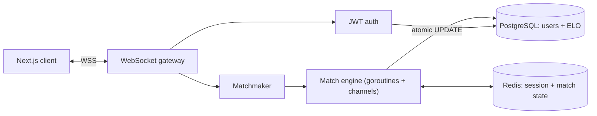

## The problem

Practicing data-structures problems alone is a solved problem; competing on them live is not. CodeArena pairs two players into a real-time match on the same problem, streams each side's state over a persistent connection, and settles the result with an ELO update the moment a match ends. The engineering interest is entirely in the runtime: many concurrent, long-lived connections, shared match state, and a scoring write that must stay correct under a race.

## Architecture



The client holds one WebSocket to the Go server. Authentication is verified on connect; the matchmaker pairs waiting players; the match engine owns the live state of each pairing and coordinates the two connections through channels. Session and match state live in Redis so the app server stays stateless; durable data — accounts and ELO — lives in PostgreSQL.

## Engineering decisions

This section is the point of the page. Each decision below states the tension I was actually weighing; the highlighted slots are where I record the choice I made and the reasoning I can defend.

### Concurrency model: goroutine-per-connection vs a bounded worker pool

Each live match holds two long-lived connections doing mostly-idle, bursty I/O. The choice is between a goroutine per connection — cheap, readable, and idiomatic in Go, since goroutine stacks start small and grow on demand — versus a bounded worker pool that caps memory and scheduler pressure during connection spikes at the cost of explicit backpressure and queueing.

<Fill>State which model I used, the memory/scheduling tradeoff on the instance size I targeted, and the failure mode (e.g. connection storms, goroutine leaks on abandoned matches) I was designing against.</Fill>

Illustrative shape of the per-connection read loop:

```go
// One reader goroutine per connection; a select drains inbound frames,
// server pushes, and shutdown without blocking any single source.
func (c *Conn) run(ctx context.Context) {
    for {
        select {
        case <-ctx.Done():
            return
        case msg := <-c.inbound:
            c.match.handle(c, msg)
        case ping := <-c.heartbeat.C:
            _ = c.writePing(ping)
        }
    }
}
```

<Callout>Illustrative — the shape of the pattern, not the repository verbatim.</Callout>

### Session state in Redis rather than sticky sessions on the app server

Holding match and session state in Redis keeps the Go process stateless, so any instance can serve any connection and the fleet scales horizontally without sticky routing. The cost is a network hop on the hot path and a dependency whose availability the match now depends on.

<Fill>Explain what stateless app servers bought me (horizontal scaling, painless deploys/restarts) versus the added latency and the Redis-failure behavior I accepted or mitigated.</Fill>

### ELO updates as atomic PostgreSQL operations

When both players finish near-simultaneously, two requests can try to read-modify-write the same ELO rows at once. A naive `SELECT` then `UPDATE` interleaves into a lost update. Performing the rating change as a single atomic statement (or inside a transaction with the right isolation) makes the update correct regardless of ordering.

<Fill>Describe the exact race — both players finishing in the same tick — and how I made the write atomic (single UPDATE expression, row locking, or serializable transaction), plus how I settle which result the rating reflects.</Fill>

### WebSocket connection lifecycle

Long-lived connections need a liveness signal, a reconnect story, and cleanup so a disconnected player doesn't strand a match or leak a goroutine.

<Fill>Give the heartbeat / ping-pong interval and read deadline, how the client reconnects and re-attaches to an in-flight match, and how the server detects and tears down abandoned matches (timeouts, forfeits, resource cleanup).</Fill>

## What I'd do differently

<Fill>The honest retrospective: what I would re-architect, what I over- or under-built, and the specific thing I'd change first if I picked this back up.</Fill>
